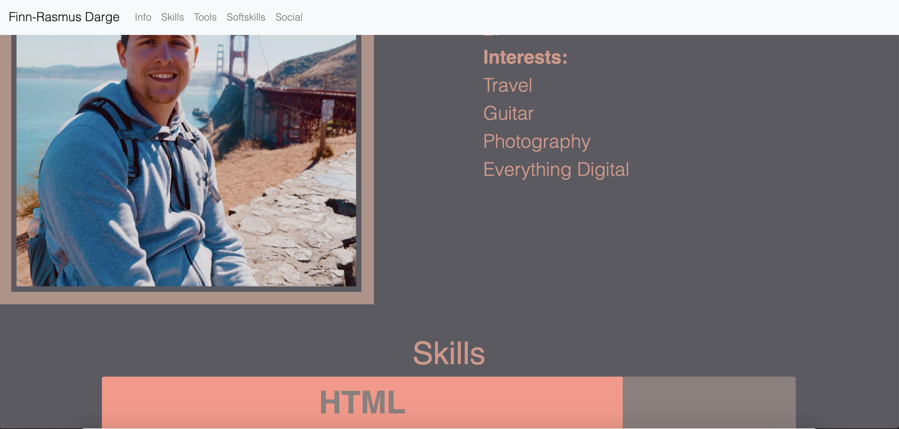

# Steckbrief
A little side-project of the FrontEnd-Developer Program from OpenCampus.

The goal of this side-project was to showcase yourself with the help of a website. I used Bootstrap 4 to quickly get a basic layout of the design I made with AdobeXD beforehand. There are some private informations missing for showcasing the work here on GitHub.

